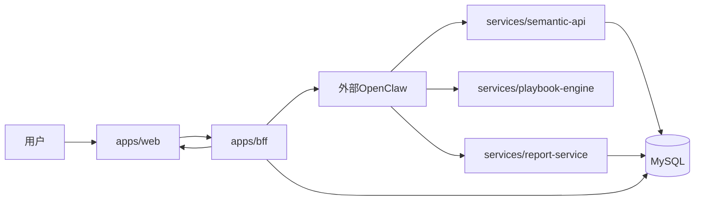
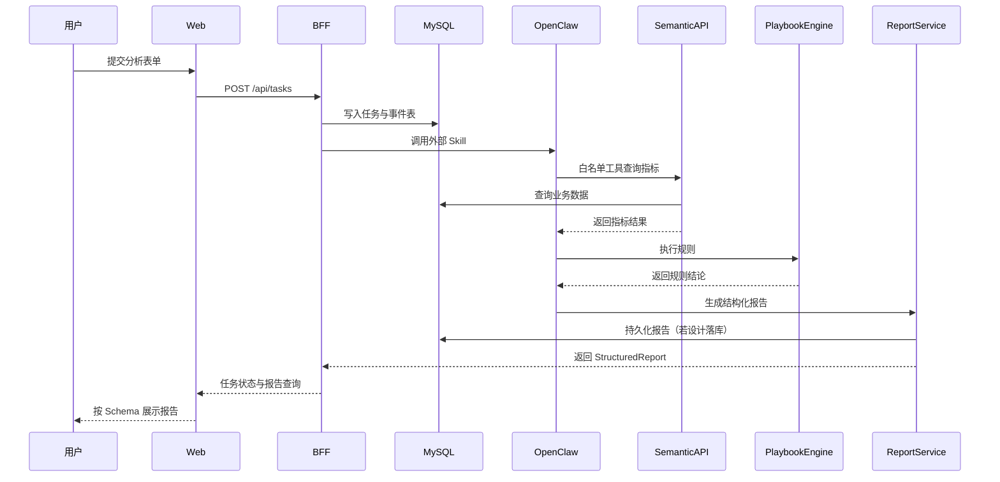

# 在线一次校验合格率管控 Demo（项目说明）

面向研发、产品、数据、业务与管理层，说明本 Demo 的目标、架构、数据流与常用英文术语含义，便于查阅与对齐。

---

## 1. 文档目标与读者

**目标**

- 说明本 Demo 如何借助 AI 完成从 0 到 1（含业务梳理、数据库、OpenClaw 与本项目联调）。
- 说明项目框架设计与各服务职责。
- 说明从用户提交表单到数据库取数、经 OpenClaw 分析、再返回报告的端到端链路。
- 说明 **`mes_demo`** 与 **`ce_agent_demo`** 两个库的职责划分及核心表用途。

**读者**

- 产品、研发、数据、业务、管理层

---

## 2. 常用术语与中文说明

文中出现的英文名称多为代码或协议中的标识，下列为**中文释义**，便于非研发读者对照阅读。

| 英文/缩写 | 中文说明 |
| --- | --- |
| **MVP**（Minimum Viable Product） | **最小可行产品**：用最少功能验证价值、先跑通闭环，再迭代扩展。文中指首版 Demo 收敛后的最小范围。 |
| **StructuredReport** | **结构化报告**：本项目中由报告服务输出的、符合统一 JSON 协议的分析报告对象（类型定义在 `@ce-demo/report-schema`）。前端按该结构渲染 KPI、图表、表格、结论文本等，而不是自由 HTML。 |
| **BFF**（Backend for Frontend） | **面向前端的后端**：本仓库中的 `apps/bff`，作为 Web 的**唯一 API 入口**，负责任务创建、状态查询、报告查询、调用 OpenClaw 及降级等，不直接承担指标计算与业务规则裁量。 |
| **OpenClaw**（龙虾） | **外部智能编排平台**：负责 Skill、模型路由、Prompt 装配与白名单工具调用编排；**不直接访问业务数据库**，通过受控 HTTP 工具调用本仓库的语义层、规则引擎、报告服务。 |
| **Skill** | **技能**：OpenClaw 侧的场景化分析能力单元，通常以 `SKILL.md` 描述边界、允许调用的工具与流程；本 Demo 有两个 Skill，对应两种分析模式（全量诊断 / 趋势简报）。 |
| **skillKey** | **技能键**：代码中标识选用哪个 Skill 的字符串，如 `quality_first_pass_yield`、`quality_fpyr_trend_brief`。 |
| **analysisType** | **分析类型**：与业务场景绑定的分析种类枚举，如 `first_pass_yield_monitoring`（全量监控）、`first_pass_yield_trend_brief`（趋势简报）；与 `skillKey` 成对校验，防止错配。 |
| **traceId** | **链路追踪 ID**：贯穿一次分析任务的主键之一，用于日志、审计与排障关联。 |
| **taskId** | **任务 ID**：BFF 为每次用户提交生成的任务唯一标识，用于轮询状态与拉取报告。 |
| **语义层** | 本仓库中的 **`services/semantic-api`**：把业务数据映射为受控指标查询，返回带审计信息的指标结果，**禁止自由 SQL**。 |
| **规则引擎** | 本仓库中的 **`services/playbook-engine`**：基于 Playbook 做阈值、判断树与结构化结论，**业务裁量的核心**，不由大模型替代。 |
| **报告服务** | 本仓库中的 **`services/report-service`**：将事实数据、规则结果与（可选的）模型补充内容装配为 **StructuredReport**。 |
| **Prompt** | **提示词**：交给大模型的指令与上下文模板；由 OpenClaw 装配，内容需与事实、规则结论对齐，不得编造指标口径。 |
| **Schema** | **模式/协议**：此处多指报告的 JSON 结构约定（区块类型、字段名等），前端只按 Schema 渲染，不自行拼装业务结论。 |
| **sourceRefs** | **来源引用**：StructuredReport 中指向指标查询、文档等溯源信息的列表，便于核对数字与结论来源。 |
| **auditTrail** | **审计轨迹**：报告或任务链路中的操作记录摘要（如创建了任务、调用了哪个服务等），用于可追溯。 |
| **白名单工具** | OpenClaw 仅允许调用的固定工具集合（如查询日趋势、执行规则、生成报告等），对应 HTTP 调用本仓库受控接口，**不可由用户或模型随意扩展未注册工具**。 |
| **直连链路** | BFF 不经过外部 OpenClaw，直接调用语义层、规则引擎、报告服务生成报告的备用路径；用于对照与故障降级。 |
| **降级** | 主路径（如 OpenClaw）失败时，自动或配置为走直连链路等备用方案，并记录原因，保证仍能产出基于规则与语义层的报告。 |

---

## 3. 一句话介绍项目

本项目是面向制造咨询场景的 AI 应用，首个 Demo 聚焦「在线一次校验合格率管控」。

核心思路不是「让大模型直接分析数据库」，而是：

1. 先把业务口径、数据来源、规则判断固化下来  
2. 再让 AI 负责编排、解释和成文  
3. 最终输出可审计、可追溯的 **StructuredReport（结构化报告）**

**概括**：可信数字来自语义层，可信结论来自规则引擎，OpenClaw 负责智能编排，前端只负责按 **StructuredReport** 展示。

---

## 4. 整个过程里 AI 如何参与（从需求到联调）

### 4.1 业务梳理阶段

AI 辅助的典型工作：

- 将「在线一次校验合格率管控」收敛为可落地的 **MVP（最小可行产品）** 范围  
- 将业务口头描述整理为结构化问题清单（口径、边界、验收）  

对应仓库文档：

- `docs/data/05-首个demo-业务确认清单.md`  
- `docs/architecture/01-场景/01-首个-demo-场景-在线一次校验合格率管控.md`  

**说明**：优先澄清「一次校验合格率如何统计」「哪些结论必须由规则引擎输出」等，再开发，可减少返工。

### 4.2 数据与数据库准备阶段

AI 辅助的典型工作：

- 梳理来源表、字段与默认过滤条件  
- 协助编写建表、初始化、种子数据脚本  
- 校验样例数据能否支撑本 Demo 的联调与验收路径  

本项目中的动作包括：

- 创建 Demo 库表（任务、事件、结构化报告等）  
- 初始化一次校验合格率、缺陷结构、设备事件等种子数据  

脚本目录：`scripts/sql/mysql/`（建库建表顺序见 `docs/data/07-首个demo-数据库初始化方案.md`）。

**说明**：目标是「本 Demo 所需最小数据集 + 可重复执行的脚本」，而非替代数据治理定稿。双库与表级职责见下文 **6.3**。

### 4.3 架构设计阶段

AI 辅助的典型工作：

- 拆分服务边界、产出初版架构说明  
- 对齐语义层、规则引擎、报告服务、OpenClaw、**BFF** 的职责  

对应文档：

- `docs/architecture/02-总体设计/01-系统边界与职责.md`  
- `docs/architecture/03-实施计划/03-openclaw-接入计划.md`  
- `docs/architecture/03-实施计划/04-外部OpenClaw-双Skill导入与打通计划.md`  

### 4.4 编码与联调阶段

AI 辅助的典型工作：

- 服务骨架与接口适配  
- OpenClaw **Skill** 与工具注册相关逻辑  
- 超时、工具未注册、降级、报告内容缺失等问题定位  
- 前端任务状态与报告页展示  

本仓库已落地的能力要点包括：

- 外部 OpenClaw 双 **Skill** 与 **BFF** 打通  
- 规则结果与模型补充总结合并进同一份 **StructuredReport**  
- 异常场景提示与直连降级  
- 任务排队、并发控制、结果复用等工程化能力（详见各服务与 **BFF** 实现）  

### 4.5 小结

AI 在本 Demo 中贯穿：**业务梳理 → 数据准备 → 架构设计 → 实现与联调 → 文档沉淀**，而非仅用于「写一段前端页面」。

---

## 5. OpenClaw（龙虾）的部署与接入取向

### 5.1 部署思路

- **外部 OpenClaw** 作为智能编排主路径。  
- 本仓库保留 **直连链路** 作为基线与 **降级** 方案。  

路径简述：

- 常规：`BFF → 外部 OpenClaw → 白名单工具 → 本仓库语义层 / 规则引擎 / 报告服务`  
- 异常或配置关闭编排时：`BFF → 直连 SemanticAPI / PlaybookEngine / ReportService`  

### 5.2 OpenClaw 在本项目中的职责

**负责**：**Skill** 与模型路由、**Prompt** 装配、白名单工具编排、解释性文字（如风险、建议、追问）生成。  

**不负责**：直接访问业务数据库、定义或改写指标口径、覆盖规则引擎对核心结论的裁量。

### 5.3 当前两个 Skill（技能）

| skillKey | 用途概要 |
| --- | --- |
| `quality_first_pass_yield` | 全量监控与异常诊断：趋势、缺陷、设备、规则、报告全链路（在编排允许范围内）。 |
| `quality_fpyr_trend_brief` | 趋势与管理简报：默认不下钻缺陷明细与设备时间线，边界在 **Skill** 文档中约定。 |

**说明**：产品上是两个边界清晰的「智能体」，工程上对应两个 **Skill** 与不同的 **analysisType**、工具子集。

---

## 6. 框架设计与各服务作用

### 6.1 总体架构（示意）

### 6.2 各服务职责一览

| 模块 | 路径/名称 | 主要职责 |
| --- | --- | --- |
| Web | `apps/web` | 向导、任务状态、报告页；按 **StructuredReport** 渲染；不做业务计算与模型决策；不直连 OpenClaw 或数据库。 |
| BFF | `apps/bff` | 唯一应用 API 入口；创建任务、**traceId**/**taskId**、调用 OpenClaw 或走直连；任务与报告落库、查询、降级与限流等。 |
| 语义层 | `services/semantic-api` | 受控指标查询、字段映射、返回带审计的指标结果。 |
| 规则引擎 | `services/playbook-engine` | Playbook 执行、阈值与结构化规则结论。 |
| 报告服务 | `services/report-service` | 装配 **StructuredReport**，维护 **sourceRefs**、**auditTrail** 等。 |
| OpenClaw | 外部部署 | 编排 **Skill**、调用白名单工具、生成解释性内容。 |
| MySQL | 双库 | **`mes_demo`**：模拟 MES/MOM 业务源，仅语义层受控只读；**`ce_agent_demo`**：应用侧任务、报告、规则与审计，由 **BFF** / 报告服务 / 规则引擎等读写。表级说明见 **6.3**。 |

共享协议包（供多服务对齐类型）：`packages/analysis-contract`、`packages/metric-contract`、`packages/report-schema`（其中 **StructuredReport** 的类型定义与此相关）。

### 6.3 两个数据库与核心表

本 Demo 在 MySQL 中拆成**两个数据库**（脚本 `scripts/sql/mysql/00-create-databases.sql`），目的是把「外部/来源业务数据」与「本应用写入的数据」分开，便于权限隔离，以及将来把 `mes_demo` 换成真实 MES、ODS 或镜像库时，应用库 `ce_agent_demo` 可保持稳定。

#### 6.3.1 `mes_demo`（模拟 MES 业务源库）

**作用**：存放与制造现场相关的**原始业务表**（本仓库用脚本模拟）。**语义层**（`services/semantic-api`）通过受控查询只读访问；应用与 OpenClaw **不直连**该库。

| 表名 | 作用（概要） |
| --- | --- |
| `tsh_pro_stock_record` | 生产/库存流转类记录：物料批次、线体、是否检验批/返工批等，支撑一次校验相关统计的时间与批次维度。 |
| `tdmmm` | 物料综合判定：与批次相关的表面/批次/综合判定码、判定时间等，用于一次校验合格与否的判定链。 |
| `tqmtq_entrust_result` | 委托检验结果明细：检验项目编码/名称、实测值、结果判定、检验时间等，支撑不合格项结构与趋势类指标。 |
| `sys_dict_data` | 系统字典数据；本 Demo 中用 `dict_type = qm_test_type` 等承载检验项目类型，与业务分类对齐。 |
| `tqmtj_deal_mat_info` | 物料配比/混料处理信息：目标批次与来源批次、混料量等，支撑混料类线索分析。 |
| `teq_repair_manage` | 设备维修管理：故障时间、完成时间、关联单元等，支撑设备事件与时间线类分析。 |

#### 6.3.2 `ce_agent_demo`（应用库）

**作用**：存放本 AI 应用的**任务、报告、规则、映射与审计**，由 **BFF**、`services/report-service`、`services/playbook-engine` 等读写；**语义层**一般不写该库（指标审计除外）。

| 表名 | 作用（概要） |
| --- | --- |
| `analysis_task` | 分析任务主表：**taskId**、**traceId**、**analysisType**、状态、进度、入参 JSON、错误信息等。 |
| `analysis_task_event` | 任务事件流：按任务记录关键步骤（如状态变更、外部调用结果摘要等），便于排障与审计。 |
| `structured_report` | **StructuredReport** 落库：与任务一对一（按设计），存完整报告 JSON 及 **sourceRefs**、**auditTrail** 等字段。 |
| `item_category_mapping` | 检验项目 → 业务分类（如磁物类、ICP 类、粒度类）的显式映射，供缺陷结构等分析使用。 |
| `rule_config` | 规则配置：按 **analysisType** / **rule_key** / 版本存放阈值等 JSON，供规则引擎加载与版本化管理。 |
| `metric_query_audit` | 语义层指标查询审计：某次任务下查了哪些指标、参数摘要、耗时与状态，支撑「数字可追溯」。 |

更细的初始化顺序、拆分理由与演进注意点见：`docs/data/07-首个demo-数据库初始化方案.md`。

---

## 7. 端到端数据流程（示例）

以下用「趋势简报」一次请求说明链路；全量诊断 **Skill** 路径类似，会增加缺陷、设备等查询步骤。

### 7.1 示例输入（说明用）

- 站点：`site-A01`  
- 时间范围：如 `2026-03-27` 至 `2026-04-13`（具体以环境数据为准）  
- **skillKey**：`quality_fpyr_trend_brief`  
- **analysisType**：`first_pass_yield_trend_brief`  

### 7.2 时序（概念）

**说明**：实际实现中，**BFF** 也可能先本地拉齐事实再调 OpenClaw 做总结，再以 **ReportService** 装配报告；以当前代码为准，上图表达的是「编排 + 受控服务」的逻辑关系。

### 7.3 步骤说明（平铺）

1. 用户在 Web 填写受控表单（站点、时间、分析模式等），提交任务。  
2. Web 调用 **BFF** `POST /api/tasks`。  
3. **BFF** 生成 **taskId**、**traceId**，写入任务与审计事件。  
4. **BFF** 按 **skillKey** / **analysisType** 白名单调用外部 OpenClaw（或失败时走直连）。  
5. OpenClaw 通过**白名单工具**调用 **SemanticAPI**，**SemanticAPI** 访问 MySQL 返回带审计的指标数据。  
6. OpenClaw 调用 **PlaybookEngine** 得到规则层结论。  
7. 需要成文时由模型在 **Prompt** 约束下补充解释（不改写口径与规则核心结论）。  
8. **ReportService** 将事实、规则结果与模型补充合并为 **StructuredReport**。  
9. **BFF** 持久化并对外提供报告查询；Web 仅渲染 **StructuredReport**，不在前端写业务判断逻辑。  

### 7.4 设计要点（四条）

1. 前端不做指标与规则裁量。  
2. OpenClaw 不直连业务库，只走受控工具。  
3. 核心结论以规则引擎为准，模型做解释与表达增强。  
4. 全链路携带 **traceId**，并保留 **auditTrail** / 事件便于审计与排障。  

---

## 8. Demo 特点小结

1. **受控架构**：非「模型直连数据库」。  
2. **规则与模型分工**：规则判断 + 模型解释。  
3. **双 Skill**：全量诊断与趋势简报，边界清晰。  
4. **StructuredReport**：统一协议，便于展示、导出与审计。  
5. **工程化**：任务落库、降级、超时、复用与并发控制等，便于向生产演进。  

---

## 9. 文档小结（核心价值）

本 Demo 验证的路径是：先把业务口径、数据、规则与系统边界固化，再用 OpenClaw 做智能编排，用大模型做解释增强；在效率与**可信数字、可审计性**之间取得平衡，并可通过同一套 **StructuredReport** 协议继续扩展场景。

---

**维护说明**：术语表、**6.3** 库表说明与端到端链路若随脚本或服务变更，请同步更新本文档、`docs/data/07-首个demo-数据库初始化方案.md` 与 `03-openclaw-接入计划.md` 等实施文档。
