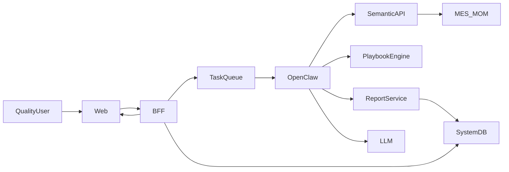

# 1. 首个 Demo 完整打通计划

## 1.1 目标

围绕“在线一次校验合格率管控”场景，完整打通从前端发起分析、后端编排、语义层查数、规则判断、模型解释、报告生成到前端动态渲染的整条链路。

## 1.2 范围

- 场景固定为 `first_pass_yield_monitoring`
- 数据源以现有 `MES/MOM` 为主
- 系统侧补齐独立应用数据库与任务/报告/审计能力
- OpenClaw 参与模型路由、工具编排和提示词装配
- 前端基于结构化报告协议完成统一渲染

## 1.3 目标链路

## 1.4 分阶段实施

### 1.4.1 阶段 1：固化任务链路与系统数据落点

- 目标：把当前 mock demo 收敛成真实的异步任务模型。
- 主要工作：
  - 固化 `analysisType = first_pass_yield_monitoring`
  - 固化 `skillKey = quality_first_pass_yield`
  - 在 `apps/bff` 中引入任务状态与结果持久化，不再依赖内存 `Map`
  - 设计系统数据库最小表：任务、报告、审计、模板/规则配置
  - 明确 BFF 对 OpenClaw 的调用输入和返回协议
- 完成标志：
  - 前端能提交任务并查询真实状态
  - 服务重启后任务和报告不会丢失

### 1.4.2 阶段 2：实现语义层

- 目标：提供可信数字，不允许自由 SQL。
- 主要工作：
  - 在 `services/semantic-api` 实现统一查询入口
  - 建立首批指标注册：
    - `fpyr_daily`
    - `defect_category_count`
    - `raw_batch_defect_rate`
    - `icp_particle_variation`
    - `equipment_event_timeline`
  - 建立业务维度到底层字段的映射
  - 先用 mock repository 跑通，再替换为真实 `MES/MOM` 查询
  - 返回 `queryAuditId`、`sourceSystem`、`dataTimestamp`、`metricDefinitions`
- 完成标志：
  - 能通过统一协议拿到一次校验合格率趋势、不合格结构、原料关联、设备事件等结果

### 1.4.3 阶段 3：实现规则引擎

- 目标：把业务判断从模型中剥离出来。
- 主要工作：
  - 在 `services/playbook-engine` 实现首版质量分析 Playbook
  - 固化判断路径：
    - 先判断 FPYR 是否异常
    - 再看不合格项目分布
    - 若磁物类异常，继续查原料批次和磁物
    - 若 ICP/粒度异常，继续查过程参数
    - 若波动与设备事件重合，再查维保记录
  - 输出结构化结论：
    - 主问题
    - 严重程度
    - 证据
    - 建议动作
    - 规则版本
- 完成标志：
  - 不依赖模型，也能输出可信的结构化诊断结果

### 1.4.4 阶段 4：接入 OpenClaw

- 目标：让分析路径由编排层驱动，而不是写死在 BFF 里。
- 主要工作：
  - 在 `services/openclaw-runtime` 接入真实 OpenClaw Gateway
  - 用 OpenClaw 替换 `apps/bff/src/index.ts` 中当前的 `simulateProcessing()`
  - 注册首批白名单工具：
    - `query_first_pass_yield_metrics`
    - `query_defect_breakdown`
    - `query_batch_material_correlation`
    - `query_icp_and_particle_metrics`
    - `query_equipment_maintenance_events`
    - `run_quality_playbook`
    - `build_quality_report`
  - 通过 Hook 注入 `traceId`、`tenantId`、`actorId`、`skillKey`
  - 配置按场景/步骤选模型的路由规则
- 完成标志：
  - OpenClaw 能根据中间结果选择后续工具调用路径
  - 模型调用与工具调用都可审计

### 1.4.5 阶段 5：实现模型解释与提示词体系

- 目标：让模型只负责解释和成文，不负责编数字。
- 主要工作：
  - 定义系统 Prompt，明确禁止编造数字与修改规则结论
  - 定义场景 Prompt 模板，输入包括：
    - 指标摘要
    - 异常分布
    - 原料/设备关联事实
    - 规则引擎输出
    - 报告风格要求
  - 配置按步骤选模型：
    - 查数、规则判断不用模型
    - 报告解释和成文调用模型
    - 复杂场景支持升级更强模型
  - 配置 fallback，模型不可用时退回规则模板文案
- 完成标志：
  - 报告中的解释文字由模型生成，但核心数字与结论仍由语义层和规则引擎决定

### 1.4.6 阶段 6：实现报告服务与模板

- 目标：统一生成结构化报告，前端不写业务逻辑。
- 主要工作：
  - 在 `services/report-service` 实现报告装配接口
  - 固化 `fpyr-demo-v1` 模板：
    - 总览
    - 异常分布
    - 关联分析
    - 结论与建议
  - 将指标结果、规则结论、模型解释整合成 `StructuredReport`
  - 保留 `sourceRefs` 与 `auditTrail`
- 完成标志：
  - 任意一次分析都能生成稳定结构的报告 JSON

### 1.4.7 阶段 7：完善前端统一渲染

- 目标：让前端真正只消费结构化报告协议。
- 主要工作：
  - 完善向导页、任务页、报告页
  - 支持区块渲染：
    - `kpi_cards`
    - `chart`
    - `table`
    - `markdown`
    - `insight_list`
  - 做空态、错误态、等待态降级展示
  - 按后端模板生成的 sections/blocks 动态渲染
- 完成标志：
  - 新增或调整报告模板时，前端主要复用既有渲染器，不再嵌入业务判断

### 1.4.8 阶段 8：多用户与演示稳定化

- 目标：支持多人同时使用并能稳定演示。
- 主要工作：
  - 引入任务队列与 worker 模式
  - 为 OpenClaw、语义层、大模型调用设置并发上限、超时、重试、降级
  - 为热点查询增加缓存
  - 准备演示数据集、历史任务与样例报告
- 完成标志：
  - 多用户同时发起任务时系统仍能稳定排队与执行

## 1.5 各模块第一批交付物

### 1.5.1 `apps/bff`

- 任务创建 API
- 任务状态查询 API
- 报告查询 API
- 调 OpenClaw 的任务适配层

### 1.5.2 `services/semantic-api`

- 指标注册表
- 统一查询入口
- 数据源适配器
- 查询审计

### 1.5.3 `services/playbook-engine`

- 质量分析 Playbook
- 阈值与判断树配置
- 结构化结论输出

### 1.5.4 `services/openclaw-runtime`

- Skill 定义
- 工具白名单
- Hook 注入
- 模型路由策略

### 1.5.5 `services/report-service`

- 报告模板
- 报告装配逻辑
- 报告 JSON 输出

### 1.5.6 `apps/web`

- 分析向导页
- 任务状态页
- 报告页
- 通用区块渲染器

## 1.6 推荐基础设施

- `MES/MOM`：原始业务数据源
- `MySQL 8.0`：系统数据库，存任务、报告、审计、配置
- `Redis`：任务队列、缓存、限流

## 1.7 里程碑

- `M1`：任务链路和系统数据库跑通，仍可使用 mock 数据
- `M2`：语义层和规则引擎接入，输出可信结论
- `M3`：OpenClaw 和模型接入，形成真实智能编排链路
- `M4`：前端打磨完成，可多人稳定演示

## 1.8 最终验收标准

- 用户能发起一次校验合格率分析任务并获得 `taskId`
- 系统能自动完成查数、诊断、生成报告
- 报告中的核心数字具备来源追溯能力
- 规则结论与模型解释职责清晰分离
- 前端仅根据结构化报告动态渲染
- 多用户并发使用时，任务能排队执行并稳定返回结果
